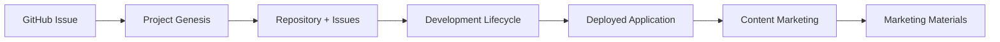

# Agentic Workflow System

A comprehensive Claude Code workflow system for automated application development from concept to deployment.

## 🏗️ Architecture

This system consists of three interconnected agentic workflows:

### 1. **Project Genesis** (`agentic-workflows/project-genesis/`)
- **Input**: GitHub issues or requirement documents
- **Process**: Explore → Plan → Code → Commit
- **Output**: Structured repositories with actionable development issues

### 2. **Development Lifecycle** (`agentic-workflows/development-lifecycle/`)
- **Input**: Issues from Project Genesis workflow
- **Process**: Write Tests → Code → Iterate → Commit
- **Output**: Tested, deployed applications

### 3. **Content Marketing** (`agentic-workflows/content-marketing/`)
- **Input**: Deployed applications from Development Lifecycle
- **Process**: Analyze → Create → Optimize → Distribute
- **Output**: Marketing materials, documentation, and promotional content

## 📁 Project Structure

```
agentic-workflows/
├── project-genesis/
│   ├── workflow.md              # Genesis workflow CLAUDE.md
│   ├── prompts/                 # Specialized prompts
│   └── examples/                # Example inputs/outputs
├── development-lifecycle/
│   ├── workflow.md              # Development workflow CLAUDE.md
│   ├── prompts/                 # TDD and deployment prompts
│   └── examples/                # Code examples
└── content-marketing/
    ├── workflow.md              # Content workflow CLAUDE.md
    ├── prompts/                 # Content creation prompts
    └── examples/                # Content templates

config/
├── mcp-servers/
│   ├── servers.json             # MCP server configurations
│   └── custom-servers/          # Custom MCP implementations
└── claude-commands/
    ├── genesis.md               # /genesis command
    ├── develop.md               # /develop command
    └── content.md               # /content command

templates/
├── github/
│   ├── workflows/               # GitHub Actions workflows
│   ├── issue-templates/         # Issue templates
│   └── pull-request-templates/  # PR templates
├── ci-cd/
│   ├── docker/                  # Docker configurations
│   └── kubernetes/              # K8s manifests
└── documentation/               # Documentation templates
```

## 🚀 Getting Started

### Prerequisites
- Claude Code CLI installed
- GitHub CLI (`gh`) configured
- Docker (optional, for containerized workflows)

### Setup
1. **Configure MCP Servers:**
   ```bash
   cp config/mcp-servers/servers.json ~/.claude/mcp.json
   ```

2. **Install Claude Commands:**
   ```bash
   cp config/claude-commands/* ~/.claude/commands/
   ```

3. **Set Environment Variables:**
   ```bash
   export GITHUB_TOKEN="your-token"
   export ANTHROPIC_API_KEY="your-key"
   ```

### Usage

#### Start Project Genesis
```bash
claude code /genesis
```
Provide a GitHub issue URL or requirements document to generate a new project.

#### Development Workflow
```bash
claude code /develop
```
Execute within a project repository to implement features from issues.

#### Content Creation
```bash
claude code /content
```
Generate marketing materials for deployed applications.

## 🔧 Configuration

### MCP Servers
Located in `config/mcp-servers/servers.json`:
- **github**: Repository management
- **filesystem**: File operations
- **planning**: Architecture analysis
- **research**: Market intelligence
- **content**: Content generation
- **deployment**: CI/CD management

### Claude Commands
Located in `config/claude-commands/`:
- **genesis.md**: Project creation workflow
- **develop.md**: Development and deployment workflow
- **content.md**: Content and marketing workflow

## 📋 Templates

### GitHub Actions
- `genesis-ci.yml`: Automated project creation
- `development-ci.yml`: CI/CD for development workflow

### Issue Templates
- `dev-ready.md`: Comprehensive development issue template
- `feature-request.md`: Feature request template
- `bug-report.md`: Bug report template

## 🔄 Workflow Integration



## 📊 Best Practices

### Project Genesis
- Always start with thorough requirement analysis
- Create issues that are 1-3 days of work maximum
- Include comprehensive testing requirements
- Document architectural decisions

### Development Lifecycle
- Follow TDD principles: Red → Green → Refactor
- Maintain 90%+ test coverage
- Deploy to staging before production
- Monitor deployment metrics

### Content Marketing
- Base content on actual product features
- Optimize for SEO and accessibility
- Maintain brand consistency
- Track performance metrics

## 🤝 Contributing

1. Fork the repository
2. Create a feature branch
3. Make your changes
4. Add tests if applicable
5. Submit a pull request

## 📄 License

MIT License - see LICENSE file for details.

## 🆘 Support

For issues and questions:
- Create an issue in this repository
- Check the documentation in each workflow directory
- Review examples in the `examples/` directories